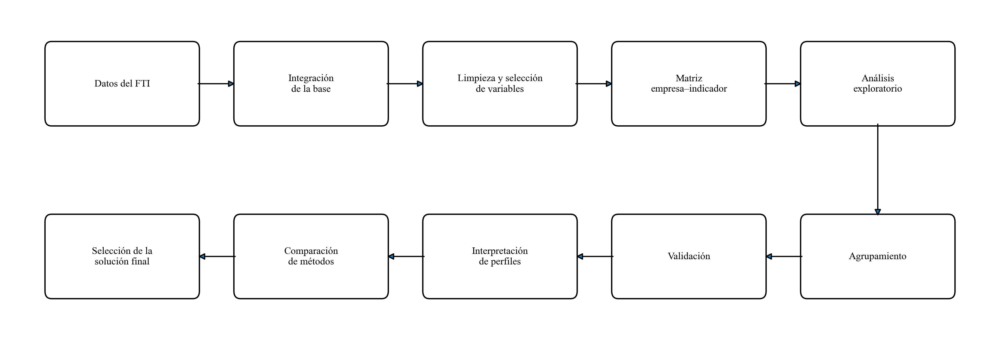
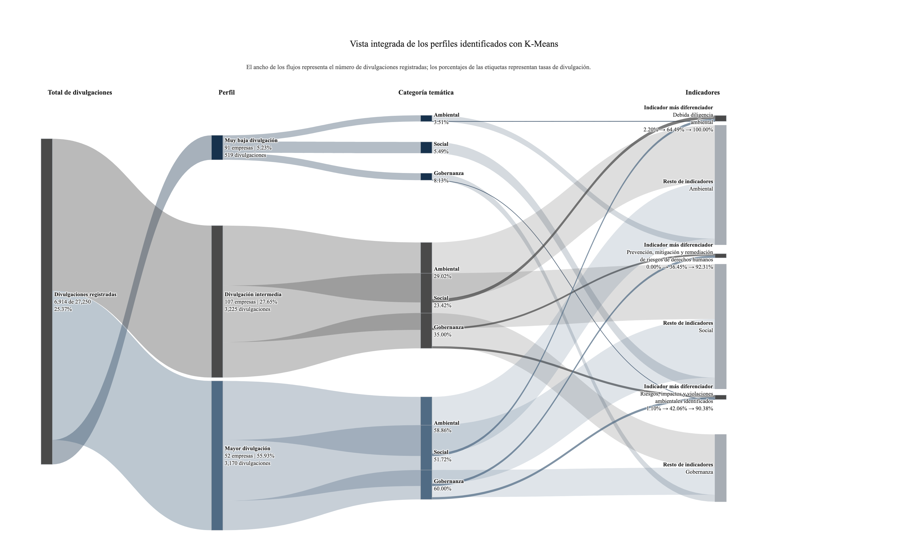

# Fashion Transparency Index 2023: perfiles de transparencia corporativa

Proyecto de Estancia de Investigación enfocado en la **identificación y caracterización de perfiles de transparencia corporativa en la industria global de la moda**, utilizando información del *Fashion Transparency Index 2023* y técnicas de agrupamiento no supervisado.

El proyecto integra y prepara los datos disponibles en WikiRate, realiza un análisis exploratorio de los patrones de divulgación y compara **K-Means** y **clustering jerárquico** para identificar grupos de empresas con comportamientos semejantes a partir de sus respuestas individuales a los indicadores.

**Estancia de Investigación · Maestría en Ciencia de Datos · ITAM**

**Autor:** Avril Salazar Rodríguez  
**Profesor asesor:** Dr. Juan Manuel Casanueva Vargas  
**Año:** 2026

---

## Objetivo del proyecto

El objetivo es **identificar y caracterizar perfiles diferenciados de transparencia corporativa entre las principales empresas globales de moda**, utilizando los indicadores del *Fashion Transparency Index 2023*.

En lugar de observar únicamente puntajes generales o promedios por categoría, el análisis utiliza las respuestas individuales de cada empresa para determinar si existen grupos con patrones de divulgación semejantes.

La pregunta principal del proyecto es:

> **¿Existen perfiles diferenciados de transparencia corporativa entre las principales empresas globales de moda que no son evidentes a través de los resultados agregados publicados por el Fashion Transparency Index?**

---

## Datos y alcance

La fuente principal es el conjunto de datos del **Fashion Transparency Index 2023 disponible en WikiRate**.

El proyecto trabaja con:

- **250 empresas**
- **130 métricas** disponibles en el dataset utilizado
- Información correspondiente a **2023**
- País de sede como variable descriptiva

Las descargas originales fueron integradas, verificadas y documentadas antes de realizar el análisis.

Debido a que las métricas presentan distintos tipos de respuesta, para el agrupamiento se seleccionaron únicamente aquellas que podían compararse bajo una misma estructura. Después de revisar su variabilidad, la matriz final utilizada para clustering quedó formada por:

```text
250 empresas × 109 indicadores binarios
```

Cada indicador se representa como:

```text
1 = la empresa divulga la información
0 = la empresa no divulga la información
```

El análisis estudia **divulgación pública de información**. Por lo tanto, un mayor nivel de transparencia no implica necesariamente un mejor desempeño ambiental o social, mayor sostenibilidad ni cumplimiento regulatorio.

---

## Flujo del análisis



El proyecto se desarrolló en cuatro etapas principales:

```text
Construcción de la base integrada
        ↓
Limpieza y selección de variables
        ↓
Análisis exploratorio de datos
        ↓
Agrupamiento y caracterización de empresas
```

---

## Estructura del repositorio

```text
fashion-transparency-index-2023/
│
├── raw/
│   ├── Auxiliary/
│   ├── Environment/
│   ├── Governance/
│   ├── Other/
│   └── Social/
│
├── processed/
│   ├── base_integrada.csv
│   ├── base_integrada_limpia.csv
│   ├── diccionario_indicadores.xlsx
│   ├── diccionario_variables.xlsx
│   ├── empresas_pendientes_revision.xlsx
│   ├── matriz_empresas_clustering.csv
│   ├── resultado_jerarquico_clusters.csv
│   └── resultado_kmeans_clusters.csv
│
├── scripts/
│   ├── 01_construccion_base_integrada.ipynb
│   ├── 02_Limpieza_y_selección_de_variables.ipynb
│   ├── 03_Analisis_exploratorio_de_datos.ipynb
│   └── 04_Agrupamiento_de_empresas (clustering).ipynb
│
├── docs/
│   ├── visualizaciones del EDA
│   ├── visualizaciones de K-Means
│   ├── visualizaciones del clustering jerárquico
│   └── diagramas de Sankey en PNG y HTML
│
├── requirements.txt
├── .gitignore
└── README.md
```

---

## Descripción de las libretas

### `01_construccion_base_integrada.ipynb`

- **Entrada:** archivos originales almacenados en `raw/`
- **Salida:** base integrada y diccionarios en `processed/`
- Integra las descargas parciales obtenidas desde WikiRate, revisa su estructura, elimina registros duplicados e incorpora información descriptiva como el país de sede.

### `02_Limpieza_y_selección_de_variables.ipynb`

- **Entrada:** `processed/base_integrada.csv`
- **Salida:** base limpia y matriz empresa–indicador
- Revisa los tipos de respuesta, selecciona los indicadores comparables, transforma las respuestas binarias y construye la matriz utilizada posteriormente para el agrupamiento.

### `03_Analisis_exploratorio_de_datos.ipynb`

- **Entrada:** `processed/base_integrada_limpia.csv`
- **Salida:** tablas y visualizaciones en `docs/`
- Analiza los niveles generales de divulgación, categorías temáticas, indicadores, país de sede e indicadores no binarios. También incorpora contexto institucional y regulatorio como apoyo para la interpretación de los resultados.

### `04_Agrupamiento_de_empresas (clustering).ipynb`

- **Entrada:** `processed/matriz_empresas_clustering.csv`
- **Salida:** asignaciones de clusters y visualizaciones finales
- Evalúa **K-Means** y **clustering jerárquico**, compara diferentes configuraciones y caracteriza los perfiles obtenidos a partir de su nivel de divulgación, categorías, indicadores y composición empresarial.

---

## Resultados principales

Los dos métodos evaluados muestran que la principal estructura de los datos corresponde a una **gradación en la intensidad general de divulgación**, más que a grupos especializados exclusivamente en temas ambientales, sociales o de gobernanza.

La solución final seleccionada fue **K-Means con tres clusters**, que permite distinguir:

| Perfil | Empresas | Divulgación promedio |
|---|---:|---:|
| Muy baja divulgación | 91 | 5.23% |
| Divulgación intermedia | 107 | 27.65% |
| Mayor divulgación | 52 | 55.93% |

La selección de esta solución no se realizó únicamente a partir del coeficiente de Silhouette. También se consideraron la estabilidad del agrupamiento, el tamaño de los grupos y su utilidad para conservar un perfil intermedio que la solución jerárquica resume dentro de dos grupos más amplios.

Los resultados muestran además que pertenecer al perfil de mayor divulgación **no significa publicar toda la información evaluada**. Incluso dentro de este grupo permanecen vacíos importantes en determinados indicadores.



---

## Archivos principales generados

| Archivo | Contenido |
|---|---|
| `base_integrada.csv` | Base consolidada con las métricas disponibles |
| `base_integrada_limpia.csv` | Base preparada para el análisis exploratorio |
| `diccionario_variables.xlsx` | Descripción de las variables |
| `diccionario_indicadores.xlsx` | Documentación de los indicadores |
| `matriz_empresas_clustering.csv` | Matriz utilizada para el agrupamiento |
| `resultado_kmeans_clusters.csv` | Perfil asignado mediante K-Means |
| `resultado_jerarquico_clusters.csv` | Perfil asignado mediante clustering jerárquico |

Las visualizaciones generadas durante el análisis se encuentran en `docs/`. Los diagramas de Sankey también se conservan en formato `.html` para mantener su versión interactiva.

---

## Instalación y ejecución

### 1. Clonar el repositorio

```bash
git clone https://github.com/avrilsalazarrodriguez/fashion-transparency-index-2023.git
cd fashion-transparency-index-2023
```

### 2. Crear un entorno virtual

```bash
python -m venv .venv
```

Activarlo en macOS/Linux:

```bash
source .venv/bin/activate
```

### 3. Instalar dependencias

```bash
pip install -r requirements.txt
```

### 4. Configurar la ruta del proyecto

Los notebooks utilizan una variable `ruta_proyecto`.

Si el repositorio se encuentra en otra ubicación, esta ruta debe modificarse al inicio de cada libreta:

```python
from pathlib import Path

ruta_proyecto = Path(
    "/ruta/local/fashion-transparency-index-2023"
)
```

### 5. Ejecutar las libretas

Las libretas deben ejecutarse en el siguiente orden:

```text
01_construccion_base_integrada.ipynb
02_Limpieza_y_selección_de_variables.ipynb
03_Analisis_exploratorio_de_datos.ipynb
04_Agrupamiento_de_empresas (clustering).ipynb
```

Cada etapa utiliza archivos generados en la anterior.

---

## Dependencias principales

Las versiones utilizadas se encuentran en `requirements.txt`.

- pandas
- numpy
- matplotlib
- scikit-learn
- scipy
- plotly
- kaleido
- openpyxl

---

## Consideraciones del análisis

Los perfiles obtenidos deben interpretarse como una **segmentación exploratoria** de las empresas incluidas en el *Fashion Transparency Index 2023*.

En particular:

- El análisis corresponde únicamente a la edición **2023**.
- El clustering utiliza **109 indicadores binarios**; los indicadores con otros tipos de respuesta se analizan de manera descriptiva.
- El país de sede se utiliza únicamente para contextualizar los resultados y no como variable de agrupamiento.
- Las asociaciones observadas entre regulación, país y divulgación no se interpretan como relaciones causales.
- Una mayor divulgación no equivale automáticamente a mejor desempeño ni a cumplimiento regulatorio.

---

## Referencias principales

- Fashion Revolution. (2023). *Fashion Transparency Index 2023*.
- WikiRate. (2023). *Fashion Transparency Index 2023 dataset*.
- MacQueen, J. (1967). *Some methods for classification and analysis of multivariate observations*.
- Murtagh, F., & Contreras, P. (2012). *Algorithms for hierarchical clustering: an overview*.
- Romano, S., Vinh, N. X., Bailey, J., & Verspoor, K. (2016). *Adjusting for chance clustering comparison measures*.
- Rousseeuw, P. J. (1987). *Silhouettes: A graphical aid to the interpretation and validation of cluster analysis*.
- Schubert, E. (2023). *Stop using the elbow criterion for k-means and how to choose the number of clusters instead*.

Las referencias institucionales, regulatorias y metodológicas completas utilizadas durante el análisis se encuentran documentadas dentro de las libretas del proyecto.

